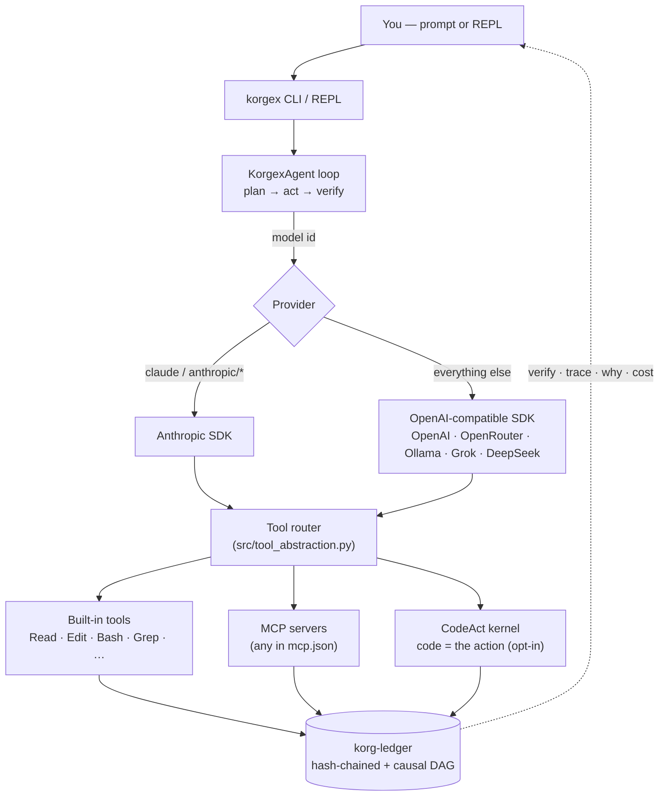
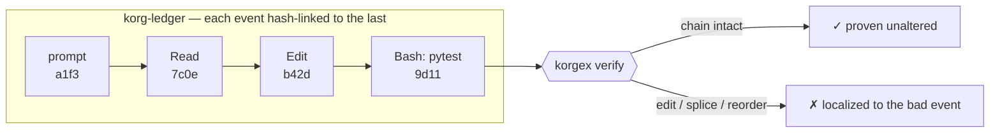
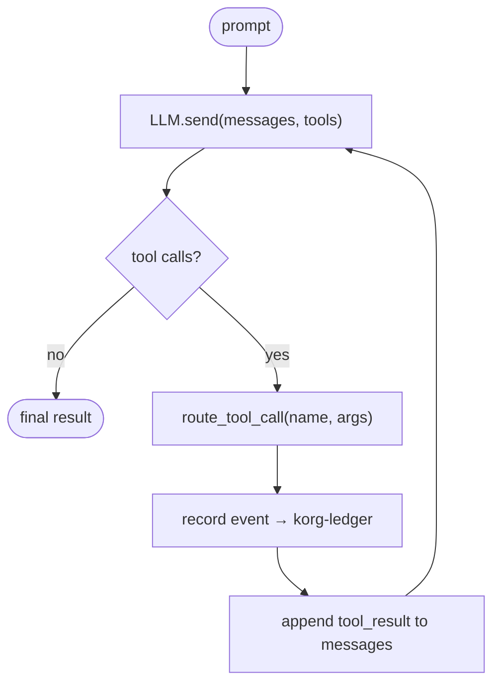

<p align="center">
  
</p>

<p align="center">
  <a href="https://pypi.org/project/korgex/"></a>
  <a href="https://pypi.org/project/korgex/"></a>
  <a href="https://github.com/New1Direction/korgex/actions/workflows/tests.yml"></a>
  
  <a href="https://registry.modelcontextprotocol.io/"></a>
  <a href="LICENSE"></a>
</p>

# korgex

**An AI coding teammate for your terminal — that keeps the receipts.**

Tell korgex what you want in plain English — *"fix the failing test," "add a healthcheck endpoint"* — and it reads your code, makes the change, runs the tests, and shows you exactly what it did. It's free and open-source, and it works with whatever AI you prefer (Claude, ChatGPT, Gemini, Grok, or a private model running on your own computer), so you're never locked to one company.

**Why it's different:** everything korgex does is saved to a tamper-proof record you can check later. If anyone alters that record — even by a single character — korgex can prove it. It's a coding assistant you can *audit*, not just hope to trust.

<sub><b>For developers:</b> terminal-native, plan-first, speaks both the Anthropic and OpenAI tool-use protocols, runs on any OpenAI- or Anthropic-compatible model (incl. local via Ollama), connects to any MCP server, streams live, and records every run to a hash-chained causal ledger you can check with <code>korgex verify</code>. MIT-licensed.</sub>

```bash
$ korgex "add a /healthz endpoint that returns 200 with uptime"
➤ Read(file_path=/app/routes.py)
➤ Edit(file_path=/app/routes.py, old_string=..., new_string=...)
➤ Bash(command=pytest tests/test_routes.py -q)
✓ Added GET /healthz returning {"status": "ok", "uptime_seconds": ...}

$ korgex verify
  ✓ ledger intact — 7 events, hash-chain + causal DAG verified
```

<!-- DEMO GIF goes here — see "Images to make" #2. A real terminal recording of a short run.
     Drop it at docs/images/demo.gif, then add:
     <p align="center"></p> -->

---

## Table of Contents

- [Install](#install)
- [Quickstart](#quickstart)
- [The REPL — live in it](#the-repl--live-in-it)
- [How it works](#how-it-works)
- [Verifiable cognition](#verifiable-cognition)
- [Tools](#tools)
- [Capabilities](#capabilities)
- [Safety & sandboxing](#safety--sandboxing)
- [CLI reference](#cli-reference)
- [Environment variables](#environment-variables)
- [Multi-model routing](#multi-model-routing)
- [MCP integration](#mcp-integration)
- [Plugins](#plugins)
- [Streaming TUI](#streaming-tui)
- [Architecture](#architecture)
- [Project structure](#project-structure)
- [Development & testing](#development--testing)
- [Building & releasing](#building--releasing)
- [Troubleshooting](#troubleshooting)
- [Known limitations](#known-limitations)
- [License](#license)

---

## Install

### From PyPI (recommended)

```bash
pip install -U korgex          # or, for an isolated global CLI:
uv tool install korgex@latest
```

Requires Python ≥ 3.10 (tested on 3.10, 3.11, 3.12, 3.13).

### From source / latest `main`

```bash
git clone https://github.com/New1Direction/korgex.git && cd korgex && pip install -e .
# or, without cloning:
pip install git+https://github.com/New1Direction/korgex.git
```

---

## Quickstart

```bash
# 1. Connect a provider (interactive — saves to ~/.korgex/config.json)
korgex setup
# …or just export a key; any of these works:
export ANTHROPIC_API_KEY="sk-ant-..."
export OPENAI_API_KEY="sk-proj-..."
export KORGEX_API_KEY="sk-or-v1-..." KORGEX_API_URL="https://openrouter.ai/api/v1"   # OpenRouter
export KORGEX_API_URL="http://your-gpu-box:8000/v1"   # self-hosted vLLM/llama.cpp → korgex --model Qwen2.5-Coder-32B "…"

# 2. Run the agent on a naked prompt
korgex "fix the failing test in tests/test_auth.py"

# 3. Or pick a model / mode
korgex --model claude-sonnet-4-6 "refactor src/handler.py"
korgex --mode plan "design a rate limiter for the API"
korgex --quiet "list the python files in src/"     # no TUI — pipe-friendly

# 4. Prove the run wasn't altered afterward
korgex verify
```

Run bare `korgex` with no prompt to drop into the interactive REPL.

---

## The REPL — live in it

Run bare `korgex` for a streaming, multi-turn session. It connects your MCP servers, reads your project rules, and keeps a per-session rewind log.

**Slash commands**

| Command | What it does |
|---|---|
| `/loop <task>` | Grind a task list unattended — auto-continues turn after turn until done, with a hard cap (Ctrl-C stops). |
| `/diff [n]` | Colored diffs of what changed in the last turn (or turn `n`). |
| `/rewind [n]` | List undo points, or restore files to BEFORE prompt `n`. |
| `/skills` · `/skills curate` | List skills korgex learned (✦); curate merges near-duplicates. |
| `/tasks` · `/jobs` | The live task checklist; background shell jobs. |
| `/plan [on\|off]` | Plan mode — read-only until you approve the agent's plan. |
| `/model [id]` | Show a priced model menu, or switch the live model mid-session. |
| `/verify` · `/cost` | Verify the session ledger; show estimated $ spend from recorded tokens. |
| `/resume [id]` | Reload a prior session's transcript into context and continue where you left off. |
| `/<name> [args]` | Run a **custom command** — a markdown prompt from `.korgex/commands/` (or a built-in like `/code-review`, `/build-fix`, `/checkpoint`). |
| `/clear` · `/help` · `/exit` | Reset the conversation · help · quit. |

**Inline shortcuts**

- **`@path/to/file`** — mention a file and its contents are pulled into the turn: `refactor @src/auth.py to use @src/db.py`.
- **`!command`** — run a shell command right there: `!git status`, `!pytest -q`.

**Project rules.** `korgex init` scaffolds an `AGENTS.md`; korgex auto-reads it — plus any nested `AGENTS.md` up the tree and `.korgex/rules/*.md` — every session, so it follows your house style.

**Prompt caching** keeps the system prompt + tools warm across turns (automatic on OpenAI/Gemini/Grok/DeepSeek; `cache_control` breakpoints on Claude/Qwen). Set `KORGEX_CACHE_STATS=1` to see per-turn cache hits — and every hit is recorded on the ledger, so `korgex cost` prices cached tokens at their real discounted rate (and shows what the cache saved you), provable with `korgex verify`.

---

## How it works



The agent is provider-agnostic by design: tool schemas are translated per provider (`{name, description, input_schema}` for Anthropic, `{type:"function", function:{…}}` for OpenAI), responses are normalized into a common shape, and tool results are formatted in whichever message structure the provider expects. Every tool call — built-in, MCP, or CodeAct — is recorded to the ledger as it happens.

---

## Verifiable cognition

**In plain terms:** korgex keeps a logbook of everything it does — every file it reads, every command it runs. Each entry is sealed to the one before it, like links in a chain, so if anyone later changes, adds, or removes even one entry, the chain visibly breaks. The result is honest, checkable proof of what the AI actually did — for audits, compliance, debugging, or simple peace of mind. As far as we know, no other coding agent does this.

<!-- VERIFY SCREENSHOT goes here — see "Images to make" #3. A terminal shot of `korgex verify` (green ✓), bonus a tampered run showing the red ✗. docs/images/verify.png -->

Under the hood: every run is recorded to a **tamper-evident causal ledger**, not an opaque log. Each event is hash-linked (`prev_hash`/`entry_hash`) to the previous one *and* causally linked (`triggered_by`) to what caused it — so a whole session can be cryptographically proven intact, and any edit, deletion, reorder, or splice is detected and localized to the offending event.



```bash
korgex verify                 # prove the recorded run wasn't altered (exit 0/1, CI-friendly)
korgex trace                  # the causal trace — what the agent did + what caused it
korgex why src/auth.py        # walk the causal chain back from a file change to its prompt
korgex recall "rate limiter"  # pull lean, verified context for a query — retrieve, don't carry
korgex cost                   # estimated $ spend for the session, from recorded token counts
export KORG_LEDGER_HMAC_KEY=… # make the chain tamper-PROOF, not just tamper-evident
```

**Memory drift.** A remembered fact is anchored to a sha256 baseline of its source, so when the source moves on the staleness is an exact signal — and the keep/refresh/discard reconcile decision is itself recorded to the ledger.

```bash
korgex drift                  # scan persistent memories for drift vs their source baselines (exit 0/1)
```

**Audit logs you already have — and share the proof.** `korgex audit` imports a session you already ran (auto-discovers your Claude Code logs) into a verifiable chain. Add `--html` and you get a single self-contained file that **re-verifies itself in the recipient's browser** — including a live *tamper test* that breaks the chain on purpose so anyone can feel the evidence. No setup, no buy-in, no network calls.

```bash
korgex audit --html audit.html
#   audited <session> → 2,319 ledger events
#   chain:  ✓ INTACT — tamper-evident, cryptographically verifiable
#   report: audit.html  ← open in any browser; it re-verifies itself

korgex import transcript.json     # replay any vendor's session into a korg-ledger@v1 journal
korgex trajectory --out train.jsonl   # export the journal as a provenance-stamped training trajectory
```

**Hand someone a receipt.** `korgex receipt` mints a single portable file that proves what a run did — the events (so it checks **offline**), a plain-language `--claim`, a summary, and an optional `--sign` that attests *who* with your own key. The recipient confirms it with `korgex receipt verify <file>` (exit 0/1), or just opens the `--html` and watches it re-verify itself. A provable deliverable, not a screenshot.

```bash
korgex receipt --claim "shipped /healthz + passing test" --sign --html receipt.html
#   ✓ receipt minted — 5 events, 3 tool calls, 2 files, $0.0078
#   signed by b251a84c… (your korgex identity) · tip 46263017…
#   receipt.html  ← open in any browser; it re-verifies itself

korgex receipt verify receipt.korgreceipt.json   # ✓ VALID / ✗ INVALID (CI-gateable)
```

See [Self-Coding Bench](docs/self-coding-bench.md) for live reliability data across models.

---

## Tools

The agent sees **23 high-level, model-facing tools** (Claude-Code style), each with a deep description covering usage, edge cases, and anti-patterns. Under the hood they route to ~60 internal handlers (`src/tools_impl.py`).

| Tool | Purpose |
|---|---|
| **Read** · **Write** · **Edit** | Read a file; create/overwrite; surgical string-replace (converted to SEARCH/REPLACE internally). |
| **Bash** · **BashOutput** | Run a shell command with timeout; poll a long-running background job. |
| **Grep** · **Glob** | Regex content search (ripgrep where available); list files by pattern. |
| **Agent** · **Orchestrate** | Delegate a sub-task to a sub-agent; run a **parallel DAG** of sub-agents (see [Capabilities](#capabilities)). |
| **TaskCreate** · **TaskUpdate** | Track and update multi-step work as a task list. |
| **AskUserQuestion** | Ask a clarifying question with optional multiple-choice. |
| **Skill** · **ToolSearch** | Invoke an installed skill; discover tools at runtime by keyword. |
| **WebFetch** · **WebSearch** | Fetch a URL as clean text; search the web. |
| **Recall** | Pull relevant facts from cross-session memory (drift-checked). |
| **Retrieve** | Pull the exact bytes of a large tool result that was sealed to a content-ref. |
| **BusSend** · **BusInbox** | Send/receive on the verifiable agent message bus (tamper-evident coordination). |
| **python** *(opt-in)* | **CodeAct** — run Python as the action, with tools available as functions. |
| **NetCapture** *(opt-in)* | Auditable HTTP(S) capture of an app you wrote — debug API calls without cURL. |
| **RemoteSignTip** *(opt-in)* | Sign a ledger tip via a remote signer you control (key off-host). |

---

## Capabilities

Beyond the core file/shell/search loop, korgex ships several deeper systems. The riskier ones are **opt-in and off by default** (a single env var), and every one of them records to the verifiable ledger.

- **CodeAct — code as the action space** (`KORGEX_CODEACT_ENABLE=1`). A persistent, fuel-metered Python kernel where the model writes code that calls tools as functions — denser than one-tool-call-per-turn. The nested execution trace is recorded to the ledger; optional OS-level isolation via bubblewrap on Linux (`KORGEX_CODEACT_ISOLATION=1`).
- **Multi-agent orchestration** (`KORGEX_PARALLEL_AGENTS`, plus the `Orchestrate` tool). Run a DAG of sub-agents concurrently — ledger-native and verifiable, with hard one-level nesting and each sub-run chained under its parent.
- **Auditable network capture** (`KORGEX_NETCAPTURE_ENABLE=1`). Run an app/script you wrote under a local CA-signing capture proxy and get a structured, redacted trace of every HTTP(S) exchange. Process-scoped, capture-only, secrets masked before they're recorded.
- **Verifiable browser** (`KORGEX_BROWSER_STEALTH`, `KORGEX_BROWSER_EVAL`). CDP-driven snapshot→act browser automation, ledger-recorded; opt-in stealth.
- **Remote signing** (`KORGEX_REMOTE_SIGNER_*`). Sign a ledger tip via an HTTP signer **you own and control**, so the signing key can live off the agent host (a separate box, an HSM). Fail-closed: bearer token, host allowlist, optional pubkey pinning, local signature verification.
- **Verifiable agent bus** (`korgex bus`, `KORG_BUS_*`). Agents coordinate over an Ed25519-signed, tamper-evident korg-ledger journal — "who said what" is a signature, not a claim.
- **Recall + memory** — cross-session memory that is drift-checked against source baselines ([Verifiable cognition](#verifiable-cognition)).
- **Local models** (`korgex local`). Hardware-aware advisor (CPU/RAM/GPU/VRAM → ranked, fit-scored picks via [llmfit](https://github.com/AlexsJones/llmfit), optional) that can wire a local Ollama model as your default.

---

## Safety & sandboxing

- **Destructive-command guard** (on by default; `KORGEX_COMMAND_GUARD`). A whitelist-first, quote/comment-aware floor over `Bash` (and the CodeAct bridge) that refuses obviously destructive commands; a block is a tamper-evident `command_guard.block` event in the ledger.
- **Bash sandbox** (`KORGEX_SANDBOX=modal|docker|direct|auto`). Controls isolation for shell execution.
- **CodeAct OS isolation** (`KORGEX_CODEACT_ISOLATION=1`, Linux/bubblewrap) for the code kernel.
- **Edit confirmation.** Diffs for `Edit`/`Write` on critical files prompt `[y/N]` in the TUI; the edit policy is configurable via `KORGEX_EDIT_POLICY`.
- **Opt-in by default for anything powerful.** CodeAct, NetCapture, remote signing, and browser stealth are all off until you turn them on.

---

## CLI reference

```
$ korgex --help
usage: korgex [-h] SUBCOMMAND ...

korgex — autonomous coding agent. Pass a naked prompt to run the agent, or use a subcommand.
```

Any non-subcommand argument is treated as a prompt: `korgex "create hello.txt with 'hi'"`.

### Flags

| Flag | Purpose |
|---|---|
| `--model MODEL` | Override the model (e.g. `claude-sonnet-4-6`, `gpt-4o`, `openai/gpt-4o-mini`). Always wins over `--mode`. |
| `--mode {plan,execute,explore,review,debug,research}` | Mode-based model selection (see [Multi-model routing](#multi-model-routing)). |
| `--mcp` | Load MCP servers from `mcp.json` at startup. |
| `--quiet` / `-q` | Disable the streaming TUI; only the final result prints. Use in pipes, scripts, CI. |
| `--version` / `-V` | Print the korgex version and exit. |
| `--resume` | Resume the last session — replay its transcript from the verifiable ledger. With a prompt: resume + run it; bare `korgex --resume`: reopen the REPL with that context. |

### Subcommands

| Subcommand | Behavior |
|---|---|
| `korgex setup` | Connect model providers (any of them) — saves keys + a default model to `~/.korgex/config.json`. |
| `korgex init` | Scaffold a starter `AGENTS.md` for the repo (detects stack + test/build commands; never clobbers). |
| `korgex skills` | List every available skill (built-in, project, learned) with its description. |
| `korgex sessions` | List recent sessions in this repo's ledger (resume one with `korgex --resume`). |
| `korgex commands` | List custom slash commands (built-in, project, user); invoke them in the REPL as `/<name>`. |
| `korgex local` | Recommend (and optionally wire) a local model that fits this machine. |
| **Verifiable cognition** | |
| `korgex verify [journal]` | Prove the ledger's hash-chain + causal DAG is intact (exit 0/1, CI-friendly). |
| `korgex trace` | Show the causal cognition trace — what the agent did and what caused it. |
| `korgex why <path>` | Trace why a file was changed, back through the causal chain to its prompt. |
| `korgex cost` | Estimated $ spend for the session, from the ledger's recorded token counts. |
| `korgex drift` | Scan persistent memories for drift against their source baselines (exit 0/1). |
| `korgex audit [--html f]` | Audit a session you already ran into a verifiable ledger (auto-discovers Claude Code logs). |
| `korgex import <file>` | Replay another vendor's session transcript into a korg-ledger@v1 journal. |
| `korgex trajectory` | Export a journal as a verifiable, provenance-stamped training trajectory. |
| `korgex bus` | Verifiable agent message bus over a tamper-evident korg-ledger journal. |
| **MCP & integrations** | |
| `korgex mcp` | Manage MCP servers — add/list/remove stdio or remote (url+auth) servers in `mcp.json`. |
| `korgex mcp-server` | Run the korg-ledger MCP server (JSON-RPC over stdio) — verify/audit/import for any MCP host. |
| `korgex diag <path>` | Report language-server diagnostics (errors/types) for a file — best-effort. |
| **Dashboard / editor** | |
| `korgex acp` | Run korgex as an [Agent Client Protocol](https://agentclientprotocol.com) agent over stdio, so an ACP editor (Zed et al.) can drive it — streams tool-call activity + reply text live. |
| `korgex serve` · `dashboard` | Start the FastAPI dashboard (`:8090`) with/without opening the VS Code sidecar. |
| `korgex status` · `stop` | Report / terminate the background backend. |
| `korgex install-extension` | Install the compiled `.vsix` into your local VS Code. |

### Drive korgex from your editor (ACP)

korgex speaks the open **Agent Client Protocol** as an *agent*, so an ACP-capable editor can drive it directly — one verifiable, cross-vendor agent in your editor's agent panel. In **Zed**, add korgex as an external agent in `settings.json`:

```json
{
  "agent_servers": {
    "korgex": { "command": "korgex", "args": ["acp"] }
  }
}
```

Then pick **korgex** from the Agent Panel's *New Thread* menu. As it works, the editor shows live `tool_call` activity (read/edit/run/search cards) and streams the reply text — backed by the same tamper-evident ledger, so the whole session stays provable with `korgex verify`. (Editor handles a prompt turn per message; embedded `@file` context and pasted resources are accepted.)

---

## Environment variables

**Core**

| Variable | Purpose | Default |
|---|---|---|
| `ANTHROPIC_API_KEY` | Used when the model id contains "claude" or starts with "anthropic/". | — |
| `OPENAI_API_KEY` | Used for any non-Anthropic model. | — |
| `KORGEX_API_KEY` / `KORGEX_API_URL` | Generic key + base URL for OpenAI-compatible endpoints (OpenRouter, Ollama, vLLM…). | — / `https://api.openai.com/v1` |
| `KORGEX_MODEL` | Default model when neither `--model` nor `--mode` is given. | `claude-sonnet-4-6` |
| `KORGEX_PROVIDER` | Force the transport (`openai`\|`anthropic`), overriding model-id autodetect. | autodetect |
| `KORGEX_MAX_ITERATIONS` | Max agent-loop iterations before giving up. | `30` |
| `KORGEX_MCP` | `1` to auto-load MCP servers from `mcp.json`. | unset |
| `KORGEX_SANDBOX` | `modal`\|`docker`\|`direct`\|`auto` — bash isolation. | `auto` |

**Capabilities (opt-in)**

| Variable | Purpose |
|---|---|
| `KORGEX_LEAN_CONTEXT` · `KORGEX_LEAN_CONTEXT_TOKENS` | Inject lean, *verified* ledger context relevant to the prompt instead of carrying full history (budget default 800) — lets a smaller/self-hosted model run the loop. |
| `KORGEX_CODEACT_ENABLE` · `KORGEX_CODEACT_ISOLATION` | Enable the CodeAct code-kernel; OS isolation (Linux/bubblewrap). |
| `KORGEX_NETCAPTURE_ENABLE` | Enable the auditable HTTP(S) capture tool. |
| `KORGEX_PARALLEL_AGENTS` | Concurrency for multi-agent orchestration. |
| `KORGEX_REMOTE_SIGNER_TOKEN` · `_ALLOWED_HOSTS` · `_PUBKEY` · `_REQUIRE_HTTPS` | Remote-signer auth, host allowlist, pinned key, https enforcement. |
| `KORGEX_BROWSER_STEALTH` · `KORGEX_BROWSER_EVAL` | Browser stealth mode; allow in-page `evaluate`. |
| `KORGEX_COMMAND_GUARD` | Toggle the destructive-command guard (on by default). |
| `KORGEX_EDIT_POLICY` | Edit confirmation policy. |

**Ledger & bus**

| Variable | Purpose | Default |
|---|---|---|
| `KORG_JOURNAL_PATH` | Durable JSONL ledger; content-addressed blobs are written beside it. | `.korg/journal.jsonl` |
| `KORG_LEDGER_HMAC_KEY` | If set, the chain is HMAC-keyed — tamper-*proof*, not just tamper-evident. | unset |
| `KORG_BUS_AGENT` · `KORG_BUS_JOURNAL` · `KORG_BUS_KEY` | Agent id, bus journal, and Ed25519 key for the verifiable bus. | — |

Provider-detection rule: if the model id contains `"claude"` or starts with `"anthropic/"`, the Anthropic SDK is used; otherwise the OpenAI-compatible SDK (OpenAI, OpenRouter, Ollama, DeepSeek, vLLM, …). Set `KORGEX_PROVIDER=openai` to drive a `claude`/`anthropic/*` id through an OpenAI-compatible endpoint (e.g. Claude via OpenRouter).

---

## Multi-model routing

`--mode` picks a model appropriate for the work type:

| Mode | Model | Generation params |
|---|---|---|
| `plan` | Opus 4.7 | `max_tokens=64000`, `thinking={budget_tokens: 20000}`, `temperature=0.7` |
| `execute` | Sonnet 4.6 | `max_tokens=64000`, `temperature=0.3` |
| `explore` | Opus 4.7 | `max_tokens=32000`, `temperature=0.5` |
| `review` | Sonnet 4.6 | `max_tokens=16000`, `temperature=0.3` |
| `debug` | Haiku 4.5 | `max_tokens=16000`, `temperature=0.2` |
| `research` | Opus 4.7 | `max_tokens=32000`, `temperature=0.7` |

Explicit `--model` always wins over `--mode`. Default (neither set) is Sonnet 4.6.

```bash
korgex --mode plan "architect a multi-tenant billing system"
korgex --mode debug "trace why this 500 is happening"
korgex --mode execute "implement the plan we just made"
```

---

## MCP integration

*Plain version: MCP is an open "app-store" standard for AI — it lets korgex plug into outside services (GitHub, your files, a database, …) without custom glue.*

korgex includes a native MCP (Model Context Protocol) client. Any MCP server in your `mcp.json` becomes part of the agent's tool surface. Manage them from the CLI with `korgex mcp` (add/list/remove stdio **or** remote url+auth servers).

### korgex *is* an MCP server too

`korgex mcp-server` exposes the verifiable-cognition substrate over JSON-RPC/stdio so any MCP host (Claude Desktop, Cursor, …) can call:

- **`korg_verify`** — prove a korg-ledger journal is tamper-evident-intact;
- **`korg_audit`** — audit the host agent's own Claude Code logs (import + verify), zero-config;
- **`korg_import`** — import a vendor session transcript into a verifiable chained ledger.

```json
{ "mcpServers": { "korg-ledger": { "command": "korgex", "args": ["mcp-server"] } } }
```

Listed in the [MCP Registry](https://registry.modelcontextprotocol.io/) — `mcp-name: io.github.New1Direction/korg-ledger`.

### Configure & use

```json
{
  "mcpServers": {
    "github":     { "command": "npx", "args": ["-y", "@modelcontextprotocol/server-github"],     "env": { "GITHUB_TOKEN": "ghp_..." } },
    "filesystem": { "command": "npx", "args": ["-y", "@modelcontextprotocol/server-filesystem", "/tmp"] }
  }
}
```

```bash
korgex --mcp "create a GitHub issue summarizing today's bug"
```

The agent discovers each server's tools at startup, registers them into the user-facing tool list, and routes calls back to the originating server. Server failures are logged and skipped — they never crash the agent.

---

## Plugins

Extend korgex without forking it. Drop a `.py` file into `~/.korgex/plugins/` (global) or `<repo>/.korgex/plugins/` (project-local) that defines a `register(registry)` function, and it hooks into the agent loop at startup.

```python
# ~/.korgex/plugins/notify.py — ping me when a file is edited
def register(reg):
    @reg.on("post_tool")
    def on_edit(payload):
        call = payload["call"]
        if call["name"] in ("Edit", "Write"):
            print(f"  ✎ touched {call['args'].get('file_path')}")
```

**Lifecycle hooks:** `on_user_prompt` (each turn starts), `pre_tool` (before a tool runs), `post_tool` (after it returns), `on_stop` (run finishes). Plugins run **in-process** with full access — install only ones you trust — and are **fail-safe**: one that fails to import, lacks `register`, or raises is recorded and skipped without crashing startup.

---

## Streaming TUI

When stdout is a TTY, the agent streams output live via [Rich](https://rich.readthedocs.io/): thinking blocks in dimmed italic (Anthropic), text character-by-character, tool calls with a transient spinner (`⠋ Read(file_path=src/foo.py)`), `[y/N]` diff confirmation on critical edits, and graceful `Ctrl+C` interrupt (double to force-kill). Streaming auto-disables when stdout is piped, in CI, or with `--quiet`. OpenAI/OpenRouter streaming pipes through the same renderer; tool-call deltas are accumulated across chunks.

---

## Architecture

### Tool routing — stable model-facing names → internal handlers

```
User tool call (LLM-visible):     Internal handler (src/tools_impl.py):
─────────────────────────────     ─────────────────────────────────────
Read(file_path=...)         →     tool_read_file(filepath=..., context=...)
Write(file_path=..., ...)   →     tool_write_file(filepath=..., ...)
Edit(file_path, old, new)   →     tool_replace_with_git_merge_diff(merge_diff="<<<<<<< SEARCH ...")
Bash(command=...)           →     tool_run_in_bash_session(command=...)
```

The router (`src/tool_abstraction.py`) looks up the name in `_TOOL_ROUTING`, applies a `param_map` or a custom `adapter`, filters kwargs the handler doesn't accept, auto-injects `context={'repo_root': cwd}`, and catches exceptions into `{"error": ...}` so a single tool failure never kills the loop. MCP-sourced tools bypass `_TOOL_ROUTING` and dispatch through `MCPServerManager.call_tool()`.

### The agent loop



The plan-first system prompt directs the agent to plan, verify, diagnose-before-changing, and never modify build artifacts (`SYSTEM_PROMPT` in `src/agent.py`). The ledger lives in native Python (`src/korg_ledger.py`, `src/ledger_spec.py`) — no external runtime required.

---

## Project structure

```
korgex/
├── src/
│   ├── agent.py              # KorgexAgent — main loop, provider branching, streaming
│   ├── cli.py · repl.py      # argparse dispatch · interactive REPL
│   ├── tool_abstraction.py   # USER_TOOLS registry + router + MCP integration
│   ├── tools_impl.py         # ~60 internal handlers (file ops, git, GitHub, web, …)
│   ├── model_router.py       # mode → model mapping (plan/execute/debug/…)
│   ├── korg_ledger.py · ledger_spec.py · signing.py   # verifiable ledger + Ed25519
│   ├── codeact/              # code-as-action kernel (fuel-metered, isolated, traced)
│   ├── orchestrate.py        # multi-agent DAG orchestration
│   ├── recall.py · memory.py · memory_drift.py        # cross-session memory + drift
│   ├── command_guard.py · sandbox.py                  # destructive-cmd floor · bash sandbox
│   ├── netcapture.py · remote_signer.py · browser.py  # opt-in capability modules
│   ├── structured_output.py · skills.py · local_model.py
│   ├── mcp_client.py · dashboard.py · interactive.py
│   └── ...
├── docs/                     # CLI reference, comparison, getting-started, tools-reference, …
├── spec/korg-ledger-v1/      # the ledger spec (SPEC.md, EVENTS.md)
├── tests/                    # ~1,263 tests
├── .github/workflows/        # Linux CI (3.10–3.13) + PyPI publisher (OIDC)
├── pyproject.toml
└── README.md
```

---

## Development & testing

```bash
git clone https://github.com/New1Direction/korgex.git && cd korgex
uv venv .venv && source .venv/bin/activate      # or python -m venv .venv
uv pip install -e ".[dev]"                       # pytest, build, ruff, …

ruff check src/                                   # lint
pytest -q                                         # the full suite
```

The suite is **~1,285 tests** with no live LLM calls (everything is unit-tested) and runs on Linux CI across **Python 3.10, 3.11, 3.12, 3.13** on every push and PR. Major areas: the agent loop (routing, provider schemas, mode/model resolution, loop guards, the stall classifier, compaction), tools (fuzzy Edit, edit-freshness, background Bash, web), the verifiable ledger (hash-chain + causal DAG, redaction, the Ed25519 signed bus), CodeAct (kernel isolation, fuel, the tool bridge), MCP (namespaced multi-server router, OAuth refresh, full round-trip), prompt caching, skills (trust tiers, self-learning, the curator), and the REPL.

---

## Building & releasing

Releases are automated. Bump `version` in `pyproject.toml`, update `CHANGELOG.md`, merge to `main`, then cut a GitHub Release — the **PyPI publish workflow fires on `release: published` and uploads via OIDC Trusted Publishing** (with digital attestations). No manual token handling.

```bash
gh release create vX.Y.Z --title "vX.Y.Z" --notes "…"   # → triggers .github/workflows/publish.yml → PyPI
```

To build locally for inspection: `python -m build` then `python -m twine check dist/*`.

---

## Troubleshooting

**`korgex: No API key found`** — set one of `ANTHROPIC_API_KEY`, `OPENAI_API_KEY`, or `KORGEX_API_KEY` (with `KORGEX_API_URL` for non-OpenAI endpoints), or run `korgex setup`.

**`ModuleNotFoundError: No module named 'anthropic'`** (or `openai`, `rich`) — the deps weren't installed: `pip install -e .` (picks up everything from `pyproject.toml`).

**Agent loops forever on tool calls** — lower the cap: `export KORGEX_MAX_ITERATIONS=10`, and use `--quiet` to see only the final state.

**`--mcp` is slow to start** — the client connects to each server synchronously and waits for the handshake; unreachable entries in `mcp.json` each time out before being skipped. Remove dead servers or use `korgex mcp` to manage them.

**`verify` reports a break** — that's the point: it found and localized an altered/spliced event. The reported `seq_id` is where the chain diverges.

---

## Known limitations

These exist today; PRs welcome.

- **OpenAI streaming has fewer rendered events than Anthropic.** Anthropic emits thinking blocks and message-delta usage; OpenAI emits only text and tool-call chunks. Both render correctly, but the TUI is richer for Anthropic.- **Dashboard authentication is not implemented.** Don't expose port 8090 publicly without an auth-terminating reverse proxy in front.
- **The VS Code sidecar is a legacy companion** to the dashboard; korgex's primary interface is the terminal REPL.

---

## License

MIT — see [LICENSE](LICENSE).

---

## Related projects

- **[Model Context Protocol](https://modelcontextprotocol.io/)** — the open MCP standard korgex implements (as both client and server).
- **[korg](https://github.com/New1Direction/korg)** · **[korgchat](https://github.com/New1Direction/korgchat)** — the broader ecosystem around the korg-ledger.
- **[llmfit](https://github.com/AlexsJones/llmfit)** — the hardware-aware local-model advisor `korgex local` builds on (optional).
